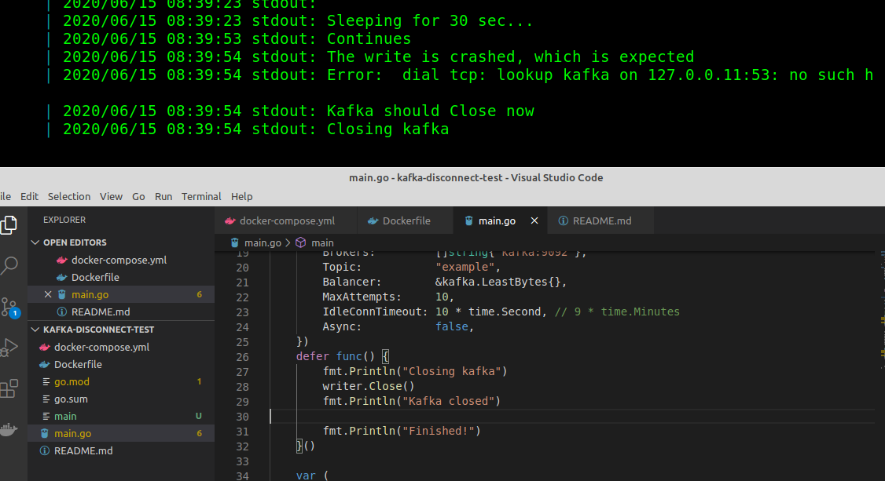

Start environment
```
docker-compose up -d --remove-orphans --build
```

Check the log
```
docker-compose logs -f --tail="all" app
```

When noted in log: Stop kafka
```
docker-compose stop kafka
```

Check that "Finished!" is never reached and printed in the logs




Afterwards you can clean up the environment with
```
docker-compose down -v
```
